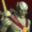

#  DefianceRMLoader - A mod loader for Legacy of Kain: Defiance Remastered
# Features
- Redirects game assets from the archives to be loaded from a `mods` folder.
- Works for HD `(.DDS/.SRM, etc.)` assets, Original `(.X64.DRM/VRM etc.)` assets are currently unsupported.
- Customizable via an INI configuration file with features such as a debug console and a file logger.
# Installation Instructions
1. Make sure you have [Ultimate ASI Loader](https://github.com/ThirteenAG/Ultimate-ASI-Loader/releases) installed beforehand into your game's directory, I recommend using the Win64 `version.dll` variant for no potential headaches.
2. Drag and drop `DefianceRMLoader.asi` and `DefianceRMLoader.ini` to your game's directory or a `scripts` folder for tidiness reasons, Either way it doesn't really matter.
   - Example 1: `F:\SteamLibrary\steamapps\common\Legacy of Kain Defiance Remastered`
   - Example 2: `F:\SteamLibrary\steamapps\common\Legacy of Kain Defiance Remastered\scripts`
3. Install mods by dragging and dropping their files into the `mods` *while making sure of the recreated file structure to match up what the game's archives have*.
   - ==============================================================
   - Example 1: `Legacy of Kain Defiance Remastered\mods\object\raziel_1.srm`
   - Matches up with: `bigfilehd.dat\object\raziel_1.srm`
   - This will replace Raziel's default remastered model.
   - ==============================================================
   - Example 2: `Legacy of Kain Defiance Remastered\mods\image_hd\lokdlogo.dds`
   - Matches up with: `bigfilehd.dat\image_hd\lokdlogo.dds`
   - This will replace the remastered version of the game's logo on the main menu.
   - ==============================================================
# Notes
- Only tested with the latest Steam version *(Patch 1.0.7)* of the game but it *should* work with the Epic Games Store and GOG versions.
- `.X64.DRM/VRM | .RAW | .MUL | .MUS | .SMF | .INI | .TXT | .BIN | .SCH | .DJK | .ARG | etc.` file formats are *exclusively* stored and loaded from `bigfile.x64.dat`.
- `.DDS | .LIGHT | .SRM | .TRACK` file formats are *exclusively* stored and loaded from `bigfilehd.dat`.
# Credits
- [TsudaKageyu](https://github.com/TsudaKageyu): For making [MinHook](https://github.com/tsudakageyu/minhook) which is used in this project.
- [ThirteenAG](https://github.com/ThirteenAG): For making [Ultimate ASI Loader](https://github.com/ThirteenAG/Ultimate-ASI-Loader) which is used by this project.
- [Indra](https://github.com/TheIndra55): RE/Programming Assistance.
